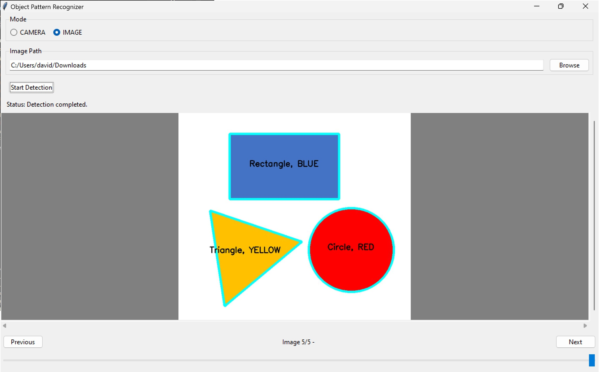

# Geometric Object Detection: Shapes and Colors

## Table of Contents
1. [Background](#background)
2. [Requirements and Setup](#requirements-and-setup)
3. [How to use Project](#how-to-use-project)
4. [Credits](#credits)

## Background
This project detects shapes and their colors within a live camera or saved images in a folder.
>**NOTE:** We do not guarantee that this programm will work in every case
### Detectable Parameters
>**Supported Image Types:** | *.jpg | *.png |

>**Detectable Shapes:** 
Triangle ▲, 
Square ■, 
Rectangle ▬, 
Pentagon ⬟, 
Hexagon ⬢, 
Circle ⬤

>**Detectable Colors:** RED  ■, 
YELLOW ■, 
GREEN ■, 
CYAN ■, 
BLUE ■, 
MAGENTA ■

**■**

## Requirements and Setup
### Requirements of project
#### Hardware: 
- Device, which can run Python. 
> **NOTE:** To take full advantage of the project, it is recommend to have a **camera** connected to the device.

#### Software:
- Python **3.10.XX** (**NOTE**: Version higher than 3.10.XX (e.g. 3.11.XX) don't work)
    - Python Releases for [Windows](https://www.python.org/downloads/windows/)
    - Python Releases for [macOS](https://www.python.org/downloads/macos/)
    - Python Releases for [other platforms](https://www.python.org/download/other/)
- preferred Python IDE, which supports pip.
- pip (for setting up virtual enviroments)
    - Installation guide for [pip](https://packaging.python.org/en/latest/guides/installing-using-pip-and-virtual-environments/#prepare-pip)

> **TIP:** If you never downloaded prior instances of 3.10.XX look for 3.10.11 on the download page. 
This includes an installer and every newer only contains a zip with security updates and no instalelr for your operating system.

### Setup project
Now after you have installed the prior mentioned software, these are the following steps:
- Create a virtual enviroment ([Guide: Create and Use Virtual Environments](https://packaging.python.org/en/latest/guides/installing-using-pip-and-virtual-environments/#prepare-pip)). 
- Install the necessary libraries with the provided `requirements.txt` ([Guide: Using a requirements file](https://packaging.python.org/en/latest/guides/installing-using-pip-and-virtual-environments/#using-a-requirements-file))
> **NOTE:** Do not edit `requirements.txt` [[here](./requirements.txt)] , if you don't know how to use it. 

If everthing went smoothly, the setup should now be completed. 

## How to use project
### Run project
To start programm, open `main.py` [[here](./main.py)] and run the programm. After a few seconds (may take longer on initial start) a window appears. 
This is the Graphical User Interface or also known as GUI. 

### Graphical User Interface (GUI)
The GUI is the window of the programm for the user to interact with.
It contains a live camera feed and Image detection from a folder to choose.

Button descriptions:
- `CAMERA`: Mode to use camera as stream for detection.
- `IMAGE`: Mode to use folder path as stream for detection
- `Browse`: Browse through directorys and select path for input.
- `Start Detection`: Starts detection in either `IMAGE`- and `CAMERA`-mode.
- `Stop Detection`: Stops detection in `CAMERA`-mode.

Scrolling through result can be done with: 
- `Previous` and `Next`
- `Slider` 

> **NOTE:** Switching modes or input path can take a few seconds to adjust. Please wait till the process is completed. 

## Credits
Authors: Jannis Mathiuet, David Meister, Patrick Lutz

